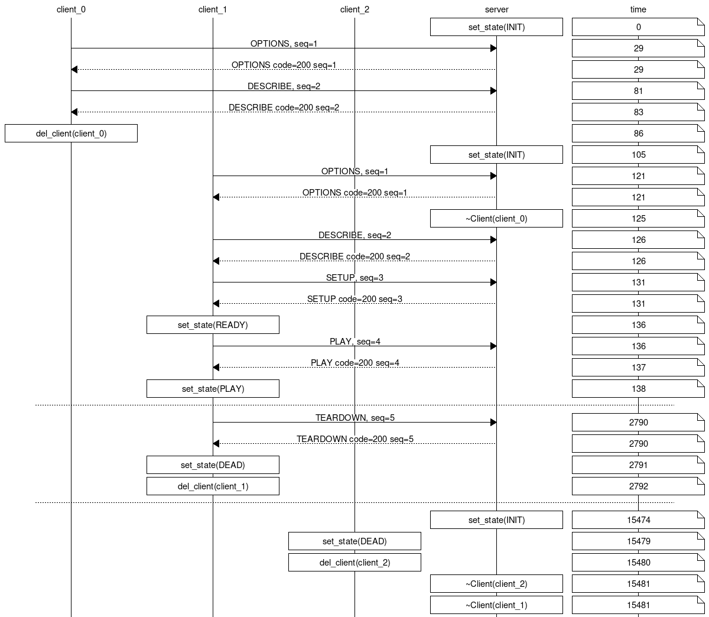

RTSP/RTP Streaming of I2S audio for the ESP32.
----

Still under development ..

Written using my 
[panglos](https://github.com/DaveBerkeley/panglos)
framework.

It runs RTSP and RTP servers on an ESP32-S3 target.
This code can also be tested and run on Linux as it is target agnostic.

I2S audio data can be received by the ESP32 and transmitted over WiFi.

I've added an Opus audio encoder to send compressed stereo 16-bit 48kHz audio over an RTS stream.

It handles multiple clients using my SocketServer class in panglos.

It uses my [CLI library](https://github.com/DaveBerkeley/cli) enabling a CLI on both
USB/UART and telnet interfaces, again allowing multiple clients.

----

The logging is my standard panglos logger.
The logging output can be used in conjunction with my 
[lex.py](https://github.com/DaveBerkeley/lex)
utility to create message sequence diagrams from the logging output.

To generate an message sequence diagram showing the communication between client and server,
first run the server on your development machine, catting the output to a text file.

    scons && ./tdd --gtest_filter="RtspServer.Test" > /tmp/a.txt

In another shell run mplayer.
After it starts playing press 'q' to quit.
Then send the special 'KILL' command to shut the server down (a debug feature)

    mplayer rtsp://localhost:8554
    echo -e "KILL xx RTSP/1.0\r\n\r\n" | nc localhost 8554

This will capture the debug log to /tmp/a.txt.
Now run the script ./msd.sh with the path to the log file.

    ./msd.sh /tmp/a.txt

This runs lex.py with filters to extract the lines of interest and outputs JSON data.
This is read by the Python script msd.py which reads the JSON data and outputs 
[mscgen](https://www.mcternan.me.uk/mscgen/)
data.

This creates the file ~/tmp/a.png that you can view in your browser.

You can see clearly that the mplayer client makes two separate client connections.
The first to gather the OPTIONS / DESCRIBE data, the second to start the stream.

By using a consistent logging format and the right tools it is easy to automatically create
visual representations of data flows, system interconnections etc.

Links
====

* [RFC3550](https://datatracker.ietf.org/doc/rfc3550/) RTP: A Transport Protocol for Real-Time Applications
* [RFC2326](https://datatracker.ietf.org/doc/rfc2326/) RTSP: Real Time Streaming Protocol v 1.0
* [RFC7826](https://datatracker.ietf.org/doc/rfc7826/) RTSP: Real Time Streaming Protocol v 2.0

* [RFC6716](https://datatracker.ietf.org/doc/rfc6716/) Definition of the Opus Audio Codec 
* [RFC8251](https://datatracker.ietf.org/doc/rfc8251/) Updates to the Opus Audio Codec 
* [RFC7587](https://datatracker.ietf.org/doc/rfc7587/) RTP Payload Format for the Opus Speech and Audio Codec 

* [xiph/opus source](https://github.com/xiph/opus) on GitHub
* [Message Sequence Chart Gen](https://www.mcternan.me.uk/mscgen/) 
